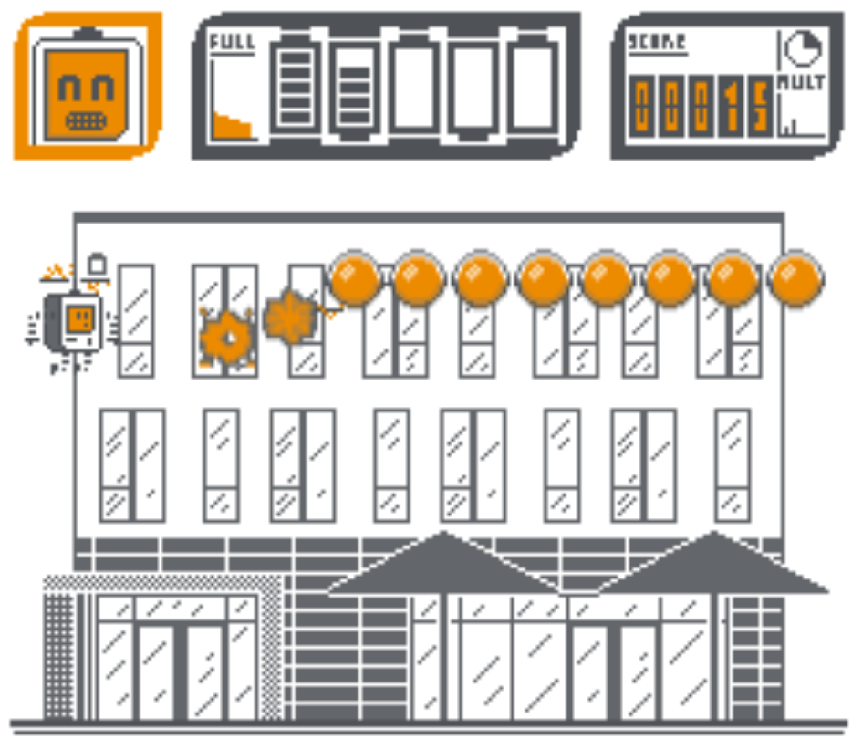

[![Engine][phaser-image]][phaser-url]
[![Sprite Editor][aseprite-image]][aseprite-url]

# arrows
A small web app based on the old DOS game by Tom Gothan.

## Installation guide

You need a small web server that runs the index.html - please make sure that all 
directories of the project are properly linked. For your convenience there is a 
ready to use python web server. Just run the main.py using python3.

## Controls

* Up/Down: Move the player
* Space: Fire a laser
* H: Help (only during the levels)  
* (Shift): Jump to the next level (debug)

# Levels

* Level 1: 10 orange balls moving up and down with same velocity that all needs to be destroyed
* Level 2: Like level 1 but with random velocity
* Level 3: 7 orange balls with random velocity  + 3 petrol enemy balls that drain 3 energy points if hit
* Level 4: 1 target moving up and down which has a small hit box
* Level 5: 25 mowing robots moving from right to left. Drain 5 energy if touched by player

# Coming soon
* hero death animation
* in between and end screen
* sounds and music
* real battery graph
* score is derived from 
  * level score
  * time used score
  * bullets left score
  * level complete bonus

* more levels
  * lvl 7 mowing robot from right to left that kills hero if they hit and have 2 lives
  * lvl 8 coffee machine shooting beans
  * ...
  
# License

MIT License

Copyright (c) 2021 Tom Gothan

Permission is hereby granted, free of charge, to any person obtaining a copy
of this software and associated documentation files (the "Software"), to deal
in the Software without restriction, including without limitation the rights
to use, copy, modify, merge, publish, distribute, sublicense, and/or sell
copies of the Software, and to permit persons to whom the Software is
furnished to do so, subject to the following conditions:

The above copyright notice and this permission notice shall be included in all
copies or substantial portions of the Software.

THE SOFTWARE IS PROVIDED "AS IS", WITHOUT WARRANTY OF ANY KIND, EXPRESS OR
IMPLIED, INCLUDING BUT NOT LIMITED TO THE WARRANTIES OF MERCHANTABILITY,
FITNESS FOR A PARTICULAR PURPOSE AND NONINFRINGEMENT. IN NO EVENT SHALL THE
AUTHORS OR COPYRIGHT HOLDERS BE LIABLE FOR ANY CLAIM, DAMAGES OR OTHER
LIABILITY, WHETHER IN AN ACTION OF CONTRACT, TORT OR OTHERWISE, ARISING FROM,
OUT OF OR IN CONNECTION WITH THE SOFTWARE OR THE USE OR OTHER DEALINGS IN THE
SOFTWARE.

[phaser-image]: https://badgen.net/badge/phaser.io/3/blue
[aseprite-image]: https://badgen.net/badge/aseprite/1.2.25/green
[phaser-url]: https://phaser.io/
[aseprite-url]: https://www.aseprite.org/